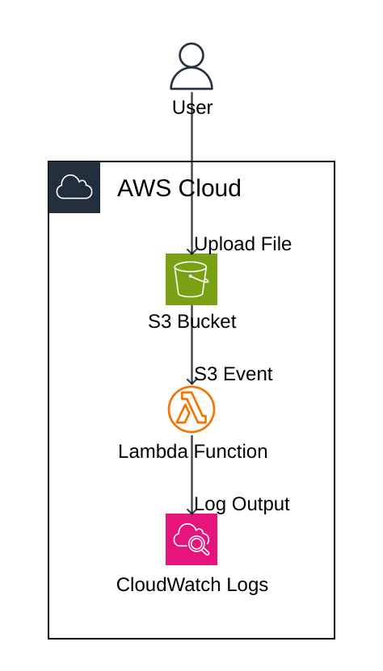

# Technical Requirements Specification

## Document Information

- **Ticket Number**: AWS-19
- **Ticket Title**: S3 bucket notification demo
- **Created Date**: 2026-01-16T12:51:22.190+0530
- **Last Updated**: 2025-01-29T10:35:00Z
- **Status**: In Progress

## 1. Project Overview

**Business Objective**: Demonstrate AWS S3 event-driven architecture by implementing automated file processing workflow using S3 bucket notifications and Lambda functions.

**Solution Summary**: Create an S3 bucket configured with event notifications that automatically triggers a Lambda function whenever a file is uploaded. The Lambda function will execute a simple "Hello World" operation to demonstrate the event-driven pattern.

**Scope**: 
- **In Scope**: S3 bucket creation, S3 event notification configuration, Lambda function deployment, IAM role setup, CloudWatch logging
- **Out of Scope**: Complex file processing logic, multiple Lambda functions, advanced error handling, file validation, multi-region deployment

## 2. Functional Requirements

### 2.1 Core Functionality

- **FR-1**: S3 bucket must accept file uploads of any extension
- **FR-2**: S3 bucket must trigger event notification on object creation (PUT, POST, COPY operations)
- **FR-3**: Lambda function must execute automatically when S3 event is triggered
- **FR-4**: Lambda function must log "Hello World" message to CloudWatch Logs

### 2.2 User Interactions

- **UI-1**: Users upload files to S3 bucket via AWS Console, CLI, or SDK
- **API-1**: S3 PutObject API triggers event notification
- **Data-1**: Lambda function receives S3 event metadata (bucket name, object key, event type)

### 2.3 Data Requirements

**Data Input**: Files of any type/extension uploaded to S3 bucket

**Data Processing**: Lambda function receives S3 event notification containing object metadata (bucket name, object key, size, timestamp)

**Data Output**: CloudWatch Logs entry with "Hello World" message and event metadata

**Data Volume**: Demo/proof-of-concept scale (low volume expected)

## 3. Non-Functional Requirements

### 3.1 Performance

- **Response Time**: Lambda function should execute within 3 seconds of file upload
- **Throughput**: Support concurrent file uploads (S3 and Lambda scale automatically)
- **Scalability**: Serverless architecture scales automatically with demand

### 3.2 Security

- **Authentication**: AWS IAM-based authentication for all services
- **Authorization**: Lambda execution role with least-privilege permissions (S3 read-only, CloudWatch Logs write)
- **Data Protection**: S3 bucket encryption at rest (AES-256), HTTPS for data in transit
- **Audit**: CloudWatch Logs for Lambda execution, CloudTrail for S3 API calls

### 3.3 Reliability

- **Availability**: Leverage AWS service SLAs (S3: 99.99%, Lambda: 99.95%)
- **Disaster Recovery**: Not required for demo (single region deployment acceptable)
- **Backup**: Not required for demo purposes

### 3.4 Operational

- **Monitoring**: CloudWatch metrics for Lambda invocations, errors, duration
- **Logging**: CloudWatch Logs for Lambda execution logs
- **Alerting**: CloudWatch alarms for Lambda errors (optional for demo)

## 4. Technical Specifications

### 4.1 Architecture

**Architecture Approach**: Serverless event-driven architecture using AWS managed services

**Architecture Diagram**: Visual representation of the AWS architecture:

**Figure 1: AWS Architecture Diagram**

**Technology Stack**:

- **Programming Language**: Python 3.12
- **Framework**: AWS Lambda runtime
- **Database**: None (stateless demo)

### 4.2 AWS Services

- **Compute**: AWS Lambda (Python 3.12 runtime)
- **Storage**: Amazon S3 (standard storage class)
- **Security**: AWS IAM (Lambda execution role)
- **Monitoring**: Amazon CloudWatch (Logs and Metrics)

### 4.3 Integration Points

**External Systems**: None

**API Contracts**: S3 event notification JSON format (standard AWS event structure)

**Data Formats**: S3 event notification in JSON format

### 4.4 Environment Requirements

- **Environments**: Single environment (development/demo)
- **Deployment**: Manual deployment via AWS Console or Infrastructure as Code (Terraform/CloudFormation)

## 5. Acceptance Criteria

### 5.1 Functional Acceptance

- [x] S3 bucket created and accessible
- [x] Lambda function deployed with Python 3.12 runtime
- [x] S3 event notification configured for ObjectCreated events
- [x] Lambda function triggered automatically on file upload
- [x] "Hello World" message logged in CloudWatch Logs

### 5.2 Non-Functional Acceptance

- [x] Lambda execution role has appropriate permissions
- [x] S3 bucket has encryption enabled
- [x] CloudWatch Logs capture Lambda execution
- [x] Lambda function executes within 3 seconds

## 6. Dependencies

### 6.1 Technical Dependencies

- **Other JIRA Tickets**: None
- **External Services**: None
- **Infrastructure**: AWS account with permissions to create S3 buckets, Lambda functions, and IAM roles

### 6.2 Team Dependencies

- **Other Teams**: None
- **Coordination**: None

## 7. Assumptions

> **IMPORTANT**: This section should be **EMPTY** during initial requirements generation. No assumptions should be made. If information is missing or ambiguous, add it as a question in the "Open Questions" section using `[Answer]:` tags.

Document key assumptions made during requirements gathering (only after clarification):

- _No assumptions - all information should be clarified through Open Questions section_

## 8. Risks

- **RISK-1**: Lambda cold start latency may delay first execution
  - **Impact**: Low
  - **Mitigation**: Acceptable for demo; can use provisioned concurrency if needed

- **RISK-2**: S3 event notification delivery is asynchronous (eventual consistency)
  - **Impact**: Low
  - **Mitigation**: Acceptable for demo; typically delivers within seconds

- **RISK-3**: Lambda execution failures not handled
  - **Impact**: Low
  - **Mitigation**: CloudWatch Logs will capture errors; acceptable for demo

## 9. Open Questions

> **CRITICAL**: This section is **MANDATORY** for identifying ambiguities. All missing or unclear information must be documented here using the format shown below. Requirements approval should not proceed until all blocking questions have `[Answer]:` filled in.

1. What AWS region should be used for deployment?
   [Answer]: us-east-1

2. Should the S3 bucket be publicly accessible or private?
   [Answer]: Private (no public access)

3. What naming convention should be used for the S3 bucket?
   [Answer]: s3-lambda-trigger-demo-{random-suffix}

4. Should the Lambda function process specific file types or all files?
   [Answer]: All file types (any extension)

5. What should be the Lambda function timeout value?
   [Answer]: 3 seconds (default)

6. What should be the Lambda function memory allocation?
   [Answer]: 128 MB (minimum)

7. Should S3 versioning be enabled on the bucket?
   [Answer]: No (not required for demo)

8. Should the infrastructure be deployed using IaC (Terraform/CloudFormation) or manually?
   [Answer]: Terraform (preferred for reproducibility)

9. What should be the Lambda function name?
   [Answer]: s3-event-handler-hello-world

10. Should CloudWatch alarms be configured for Lambda errors?
    [Answer]: No (optional for demo, not required)
