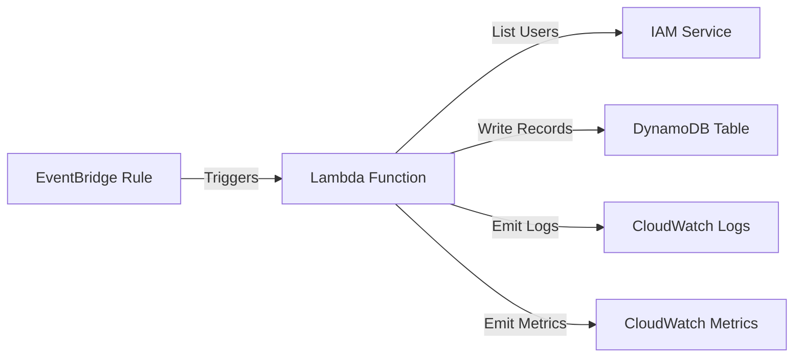

# Design Document: IAM User Monitor

## Overview

The IAM User Monitor is a serverless solution that automatically tracks IAM users in an AWS account by periodically scanning the IAM service and storing user information in DynamoDB. The system uses AWS Lambda for compute, EventBridge for scheduling, and DynamoDB for persistent storage. The entire infrastructure is provisioned using Terraform for reproducibility and version control.

## Architecture

### High-Level Architecture



### Component Interaction Flow

1. EventBridge Rule triggers Lambda Function on schedule (e.g., every hour)
2. Lambda Function calls IAM ListUsers API with pagination
3. Lambda Function processes each user and writes to DynamoDB
4. Lambda Function emits logs to CloudWatch Logs
5. Lambda Function emits custom metrics to CloudWatch Metrics

### Deployment Architecture

- **Infrastructure Layer**: Terraform manages all AWS resources
- **Compute Layer**: Lambda Function (Python 3.11 runtime)
- **Storage Layer**: DynamoDB table with on-demand billing
- **Scheduling Layer**: EventBridge rule with cron expression
- **Security Layer**: IAM roles with least-privilege permissions

## Components and Interfaces

### Lambda Function

**Purpose**: Execute the monitoring logic on schedule

**Runtime**: Python 3.11

**Handler**: `lambda_function.lambda_handler`

**Environment Variables**:
- `DYNAMODB_TABLE_NAME`: Name of the DynamoDB table
- `LOG_LEVEL`: Logging level (INFO, DEBUG, ERROR)

**Timeout**: 5 minutes

**Memory**: 256 MB

**Key Functions**:
- `lambda_handler(event, context)`: Entry point for Lambda execution
- `scan_iam_users()`: Retrieve all IAM users with pagination
- `write_user_records(users, scan_timestamp)`: Write user records to DynamoDB
- `emit_metrics(stats)`: Publish custom CloudWatch metrics

### DynamoDB Table

**Purpose**: Store historical IAM user records

**Table Name**: Configurable via Terraform variable (default: `iam-user-records`)

**Primary Key**:
- Partition Key: `user_name` (String)
- Sort Key: `scan_timestamp` (String, ISO 8601 format)

**Attributes**:
- `user_name` (String): IAM user name
- `scan_timestamp` (String): When the scan occurred
- `user_id` (String): IAM user ID
- `arn` (String): IAM user ARN
- `create_date` (String): When the user was created
- `password_last_used` (String, optional): Last password usage timestamp
- `ttl` (Number): Time-to-live epoch timestamp

**Global Secondary Index**:
- Index Name: `scan-timestamp-index`
- Partition Key: `scan_timestamp`
- Projection: ALL

**Billing Mode**: On-demand (PAY_PER_REQUEST)

**TTL**: Enabled on `ttl` attribute

### EventBridge Rule

**Purpose**: Trigger Lambda Function on schedule

**Schedule Expression**: Configurable via Terraform variable (default: `rate(1 hour)`)

**Target**: Lambda Function ARN

**State**: ENABLED

### IAM Roles and Policies

**Lambda Execution Role**:
- Trust policy: Allow Lambda service to assume role
- Managed policy: `AWSLambdaBasicExecutionRole` (CloudWatch Logs)
- Inline policy: Custom policy for IAM read and DynamoDB write

**Required Permissions**:
```json
{
  "Version": "2012-10-17",
  "Statement": [
    {
      "Effect": "Allow",
      "Action": [
        "iam:ListUsers",
        "iam:GetUser"
      ],
      "Resource": "*"
    },
    {
      "Effect": "Allow",
      "Action": [
        "dynamodb:PutItem",
        "dynamodb:BatchWriteItem"
      ],
      "Resource": "arn:aws:dynamodb:*:*:table/iam-user-records"
    },
    {
      "Effect": "Allow",
      "Action": [
        "cloudwatch:PutMetricData"
      ],
      "Resource": "*"
    }
  ]
}
```

## Data Models

### IAM User Record (DynamoDB Item)

```python
{
    "user_name": "john.doe",
    "scan_timestamp": "2025-11-24T10:00:00Z",
    "user_id": "AIDAI23EXAMPLE",
    "arn": "arn:aws:iam::123456789012:user/john.doe",
    "create_date": "2024-01-15T08:30:00Z",
    "password_last_used": "2025-11-23T14:22:00Z",  # Optional
    "ttl": 1735660800  # Epoch timestamp for TTL
}
```

### Lambda Event (EventBridge)

```python
{
    "version": "0",
    "id": "event-id",
    "detail-type": "Scheduled Event",
    "source": "aws.events",
    "account": "123456789012",
    "time": "2025-11-24T10:00:00Z",
    "region": "us-east-1",
    "resources": ["arn:aws:events:us-east-1:123456789012:rule/iam-monitor-rule"],
    "detail": {}
}
```

### Scan Statistics

```python
{
    "scan_timestamp": "2025-11-24T10:00:00Z",
    "total_users": 42,
    "records_written": 42,
    "errors": 0,
    "duration_seconds": 3.5
}
```

## Correctness Properties

*A property is a characteristic or behavior that should hold true across all valid executions of a system—essentially, a formal statement about what the system should do. Properties serve as the bridge between human-readable specifications and machine-verifiable correctness guarantees.*


### Property 1: Complete user data extraction and storage

*For any* set of IAM users returned by the IAM Service, the system should extract all required fields (user name, user ID, ARN, creation date, password last used) and write complete records to DynamoDB with all required attributes including scan timestamp.

**Validates: Requirements 1.3, 2.1, 2.2, 4.4**

### Property 2: Pagination completeness

*For any* number of IAM users across multiple pages, the system should collect all users regardless of page size or number of pages.

**Validates: Requirements 1.2**

### Property 3: Historical record creation

*For any* IAM user, running multiple scans should create multiple distinct records in DynamoDB, each with a different scan timestamp, preserving historical data.

**Validates: Requirements 2.3**

### Property 4: Error resilience in DynamoDB writes

*For any* set of user records where some DynamoDB writes fail, the system should continue processing remaining users and log errors with affected user names.

**Validates: Requirements 2.4**

### Property 5: Comprehensive error logging

*For any* error that occurs (IAM API failures, DynamoDB failures, or other exceptions), the system should log the error message, error type, contextual information, and AWS error codes when applicable.

**Validates: Requirements 1.4, 5.1, 5.4**

### Property 6: Execution observability

*For any* Lambda execution, the system should log invocation start with timestamp and configuration, emit completion metrics indicating success or failure, and log summary statistics including total users scanned, records written, and errors encountered.

**Validates: Requirements 1.5, 2.5, 3.4, 5.2, 5.3**

### Property 7: Structured logging consistency

*For any* log entry produced by the system, it should use consistent field names and structured format suitable for automated log analysis.

**Validates: Requirements 5.5**

### Property 8: Concurrency prevention

*For any* concurrent Lambda invocations, the system should detect the concurrent execution and prevent overlapping scan operations.

**Validates: Requirements 3.3**

### Property 9: Graceful timeout handling

*For any* execution where remaining time approaches the Lambda timeout limit, the system should log a warning and complete gracefully without crashing.

**Validates: Requirements 3.5**

### Property 10: Query result ordering

*For any* IAM user with multiple historical records, querying by user name should return records sorted by scan timestamp in descending order (most recent first).

**Validates: Requirements 4.2**

## Error Handling

### IAM Service Errors

**Scenario**: IAM ListUsers API call fails

**Handling**:
1. Catch boto3 ClientError exception
2. Log error with AWS error code, message, and request ID
3. Do not write any records to DynamoDB for this scan
4. Return failure status
5. Allow EventBridge to trigger next scheduled execution

**Retry Strategy**: No immediate retry; rely on next scheduled execution

### DynamoDB Write Errors

**Scenario**: Individual PutItem or BatchWriteItem fails

**Handling**:
1. Catch boto3 ClientError exception
2. Log error with user name, AWS error code, and message
3. Continue processing remaining users
4. Track failed writes in summary statistics
5. Return partial success status

**Retry Strategy**: Failed writes are not retried in same execution; will be captured in next scan

### Pagination Errors

**Scenario**: IAM API pagination fails mid-stream

**Handling**:
1. Catch exception during pagination
2. Log error with context (number of users collected so far)
3. Do not write partial results to DynamoDB
4. Return failure status

**Retry Strategy**: Next scheduled execution will start fresh

### Lambda Timeout

**Scenario**: Execution time approaches Lambda timeout

**Handling**:
1. Check remaining time before each major operation
2. If remaining time < 30 seconds, log warning
3. Complete current operation and exit gracefully
4. Log partial completion statistics
5. Next execution will perform full scan

### Concurrency Conflicts

**Scenario**: Multiple Lambda invocations overlap

**Handling**:
1. Use DynamoDB conditional write to acquire execution lock
2. If lock acquisition fails, log warning and exit immediately
3. Lock expires after 10 minutes (2x Lambda timeout)
4. Next scheduled execution will acquire lock

## Testing Strategy

### Unit Testing

The system will use Python's `unittest` framework with `moto` for AWS service mocking.

**Unit Test Coverage**:
- IAM user data extraction from API responses
- DynamoDB record formatting and attribute mapping
- Error handling for specific AWS error codes
- Logging output format and content
- Timestamp formatting and TTL calculation
- Pagination logic with various page sizes

**Example Unit Tests**:
- Test extracting user data from IAM API response with all fields present
- Test extracting user data when password_last_used is missing
- Test DynamoDB record includes all required attributes
- Test error logging includes AWS error code
- Test TTL calculation based on retention period

### Property-Based Testing

The system will use `hypothesis` library for property-based testing in Python.

**Configuration**:
- Minimum 100 iterations per property test
- Custom strategies for generating IAM user data
- Stateful testing for multi-scan scenarios

**Property Test Requirements**:
- Each property-based test MUST run at least 100 iterations
- Each test MUST include a comment tag: `# Feature: iam-user-monitor, Property X: <property text>`
- Each correctness property MUST be implemented by a SINGLE property-based test
- Tests MUST use hypothesis strategies to generate diverse input data

**Property Test Coverage**:
- Property 1: Generate random IAM user sets, verify all fields extracted and written
- Property 2: Generate paginated responses with varying page sizes, verify all users collected
- Property 3: Generate multiple scan timestamps, verify distinct records created
- Property 4: Simulate DynamoDB write failures, verify processing continues
- Property 5: Simulate various error types, verify comprehensive logging
- Property 6: Generate random execution scenarios, verify observability data
- Property 7: Collect all log entries, verify consistent structure
- Property 8: Simulate concurrent invocations, verify prevention
- Property 9: Simulate near-timeout scenarios, verify graceful handling
- Property 10: Generate multiple records per user, verify query ordering

### Integration Testing

**Scope**: End-to-end testing with real AWS services in test account

**Test Scenarios**:
- Deploy infrastructure with Terraform
- Trigger Lambda manually
- Verify records in DynamoDB
- Verify CloudWatch Logs
- Verify CloudWatch Metrics
- Test with accounts having 0, 1, 10, 100+ users
- Test concurrent execution prevention
- Verify TTL expiration after retention period

### Infrastructure Testing

**Tool**: Terraform validate and plan

**Coverage**:
- Terraform configuration syntax validation
- IAM policy validation
- Resource dependency verification
- Variable validation

## Implementation Notes

### Python Dependencies

```
boto3>=1.28.0
hypothesis>=6.90.0
moto>=4.2.0
```

### Lambda Package Structure

```
lambda_function.py       # Main handler
iam_scanner.py          # IAM user scanning logic
dynamodb_writer.py      # DynamoDB write operations
metrics_emitter.py      # CloudWatch metrics
logger_config.py        # Structured logging setup
requirements.txt        # Python dependencies
```

### Terraform Module Structure

```
main.tf                 # Main resources
variables.tf            # Input variables
outputs.tf              # Output values
iam.tf                  # IAM roles and policies
lambda.tf               # Lambda function
dynamodb.tf             # DynamoDB table
eventbridge.tf          # EventBridge rule
```

### Configuration Variables

- `monitoring_period`: Schedule expression (default: "rate(1 hour)")
- `dynamodb_table_name`: Table name (default: "iam-user-records")
- `retention_days`: TTL retention period (default: 90)
- `lambda_timeout`: Function timeout in seconds (default: 300)
- `lambda_memory`: Function memory in MB (default: 256)
- `log_level`: Logging level (default: "INFO")

### Monitoring and Alerting

**CloudWatch Metrics**:
- `IAMUserMonitor.UsersScanned`: Count of users scanned
- `IAMUserMonitor.RecordsWritten`: Count of records written to DynamoDB
- `IAMUserMonitor.Errors`: Count of errors encountered
- `IAMUserMonitor.Duration`: Execution duration in milliseconds
- `IAMUserMonitor.Success`: Binary success indicator (1 or 0)

**Recommended Alarms**:
- Alert when `IAMUserMonitor.Success` = 0 for 2 consecutive periods
- Alert when `IAMUserMonitor.Errors` > 0
- Alert when Lambda function errors > 0
- Alert when Lambda function duration > 240 seconds (80% of timeout)

### Security Considerations

- Lambda execution role follows least-privilege principle
- No hardcoded credentials in code
- DynamoDB table encryption at rest enabled by default
- CloudWatch Logs encrypted
- IAM user data does not include sensitive credentials
- VPC deployment optional (not required for IAM/DynamoDB access)

### Performance Considerations

- Batch writes to DynamoDB when possible (up to 25 items per batch)
- Pagination marker handling for large user sets
- Efficient memory usage for user data structures
- Asynchronous metric emission to avoid blocking
- Connection pooling for boto3 clients

### Cost Optimization

- DynamoDB on-demand billing for unpredictable access patterns
- TTL to automatically delete old records
- Lambda memory sized appropriately (256 MB sufficient for most accounts)
- CloudWatch Logs retention period configured (default: 30 days)
- EventBridge rule can be disabled when monitoring not needed
