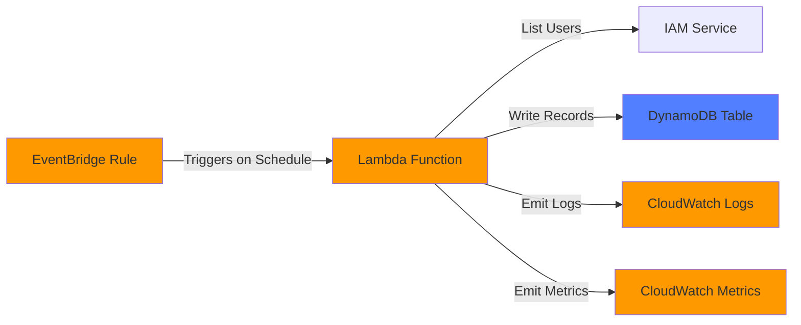

# IAM User Monitor

An automated serverless solution for monitoring and tracking IAM users in AWS accounts. The system periodically scans all IAM users and stores their information in DynamoDB, enabling audit trails, compliance monitoring, and historical tracking of IAM user configurations.

## Architecture



### Components

- **EventBridge Rule**: Triggers Lambda function on a configurable schedule
- **Lambda Function**: Executes monitoring logic (Python 3.11)
- **IAM Service**: Source of user data
- **DynamoDB Table**: Persistent storage for historical user records
- **CloudWatch Logs**: Structured logging for troubleshooting
- **CloudWatch Metrics**: Custom metrics for monitoring system health

## Features

- ✅ Automated periodic scanning of all IAM users
- ✅ Historical tracking with configurable retention
- ✅ Efficient pagination handling for large user sets
- ✅ Concurrency control to prevent overlapping executions
- ✅ Comprehensive error handling and logging
- ✅ Custom CloudWatch metrics for monitoring
- ✅ Infrastructure as Code using Terraform
- ✅ Least-privilege IAM permissions
- ✅ Encryption at rest for data and logs

## Prerequisites

- AWS Account with appropriate permissions
- Terraform >= 1.0
- Python 3.11 (for local development/testing)
- AWS CLI configured with credentials

## Quick Start

### 1. Clone and Navigate

```bash
git clone <repository-url>
cd iam-user-monitor
```

### 2. Package Lambda Function

```bash
cd lambda
./package.sh
cd ..
```

This creates `lambda/lambda_deployment.zip` with all dependencies.

### 3. Deploy Infrastructure

```bash
cd terraform
terraform init
terraform plan
terraform apply
```

### 4. Verify Deployment

```bash
# Get outputs
terraform output

# Manually trigger Lambda for testing
aws lambda invoke \
  --function-name $(terraform output -raw lambda_function_name) \
  --payload '{}' \
  response.json

# Check DynamoDB for records
aws dynamodb scan \
  --table-name $(terraform output -raw dynamodb_table_name) \
  --max-items 5
```

## Configuration

### Terraform Variables

Configure the system by creating a `terraform.tfvars` file or passing variables via command line:

| Variable | Description | Default | Valid Values |
|----------|-------------|---------|--------------|
| `monitoring_period` | Schedule expression for scan frequency | `rate(1 hour)` | EventBridge rate/cron expressions |
| `dynamodb_table_name` | Name of DynamoDB table | `iam-user-records` | 3-255 alphanumeric chars, hyphens, underscores, periods |
| `retention_days` | Days to retain records before TTL deletion | `90` | 1-3650 |
| `lambda_timeout` | Lambda timeout in seconds | `300` | 1-900 |
| `lambda_memory` | Lambda memory in MB | `256` | 128-10240 (multiples of 64) |
| `log_level` | Logging verbosity | `INFO` | DEBUG, INFO, WARNING, ERROR, CRITICAL |

#### Example terraform.tfvars

```hcl
monitoring_period    = "rate(30 minutes)"
dynamodb_table_name  = "my-iam-audit-trail"
retention_days       = 180
lambda_timeout       = 300
lambda_memory        = 512
log_level           = "INFO"
```

#### Schedule Expression Examples

```hcl
# Rate-based (simple intervals)
monitoring_period = "rate(1 hour)"      # Every hour
monitoring_period = "rate(30 minutes)"  # Every 30 minutes
monitoring_period = "rate(1 day)"       # Daily

# Cron-based (specific times)
monitoring_period = "cron(0 9 * * ? *)"     # 9 AM UTC daily
monitoring_period = "cron(0 */6 * * ? *)"   # Every 6 hours
monitoring_period = "cron(0 0 * * MON *)"   # Every Monday at midnight
```

### Environment Variables (Lambda)

These are automatically configured by Terraform:

- `DYNAMODB_TABLE_NAME`: Target DynamoDB table
- `LOG_LEVEL`: Logging verbosity level

## Data Model

### DynamoDB Schema

**Table Name**: Configurable (default: `iam-user-records`)

**Primary Key**:
- Partition Key: `user_name` (String)
- Sort Key: `scan_timestamp` (String, ISO 8601)

**Attributes**:
```json
{
  "user_name": "john.doe",
  "scan_timestamp": "2025-11-24T10:00:00Z",
  "user_id": "AIDAI23EXAMPLE",
  "arn": "arn:aws:iam::123456789012:user/john.doe",
  "create_date": "2024-01-15T08:30:00Z",
  "password_last_used": "2025-11-23T14:22:00Z",
  "ttl": 1735660800
}
```

**Global Secondary Index**:
- Name: `scan-timestamp-index`
- Partition Key: `scan_timestamp`
- Use case: Query all users from a specific scan

### Query Examples

```bash
# Get all scans for a specific user
aws dynamodb query \
  --table-name iam-user-records \
  --key-condition-expression "user_name = :username" \
  --expression-attribute-values '{":username":{"S":"john.doe"}}' \
  --scan-index-forward false

# Get all users from a specific scan
aws dynamodb query \
  --table-name iam-user-records \
  --index-name scan-timestamp-index \
  --key-condition-expression "scan_timestamp = :timestamp" \
  --expression-attribute-values '{":timestamp":{"S":"2025-11-24T10:00:00Z"}}'
```

## Monitoring and Alerting

### CloudWatch Metrics

The system emits custom metrics under the `IAMUserMonitor` namespace:

| Metric | Unit | Description |
|--------|------|-------------|
| `UsersScanned` | Count | Number of IAM users scanned |
| `RecordsWritten` | Count | Number of records written to DynamoDB |
| `Errors` | Count | Number of errors encountered |
| `Duration` | Milliseconds | Execution duration |
| `Success` | None | Binary indicator (1=success, 0=failure) |

### Recommended CloudWatch Alarms

#### 1. Execution Failure Alarm

```bash
aws cloudwatch put-metric-alarm \
  --alarm-name iam-monitor-execution-failure \
  --alarm-description "Alert when IAM monitoring fails" \
  --metric-name Success \
  --namespace IAMUserMonitor \
  --statistic Sum \
  --period 3600 \
  --evaluation-periods 2 \
  --threshold 1 \
  --comparison-operator LessThanThreshold \
  --treat-missing-data notBreaching
```

#### 2. Error Count Alarm

```bash
aws cloudwatch put-metric-alarm \
  --alarm-name iam-monitor-errors \
  --alarm-description "Alert when errors occur during IAM monitoring" \
  --metric-name Errors \
  --namespace IAMUserMonitor \
  --statistic Sum \
  --period 3600 \
  --evaluation-periods 1 \
  --threshold 0 \
  --comparison-operator GreaterThanThreshold
```

#### 3. Lambda Duration Alarm

```bash
aws cloudwatch put-metric-alarm \
  --alarm-name iam-monitor-duration \
  --alarm-description "Alert when execution approaches timeout" \
  --metric-name Duration \
  --namespace IAMUserMonitor \
  --statistic Maximum \
  --period 3600 \
  --evaluation-periods 1 \
  --threshold 240000 \
  --comparison-operator GreaterThanThreshold
```

#### 4. Lambda Error Alarm

```bash
aws cloudwatch put-metric-alarm \
  --alarm-name iam-monitor-lambda-errors \
  --alarm-description "Alert on Lambda function errors" \
  --metric-name Errors \
  --namespace AWS/Lambda \
  --dimensions Name=FunctionName,Value=<lambda-function-name> \
  --statistic Sum \
  --period 300 \
  --evaluation-periods 1 \
  --threshold 0 \
  --comparison-operator GreaterThanThreshold
```

### CloudWatch Logs Insights Queries

#### View Recent Executions

```sql
fields @timestamp, scan_timestamp, total_users, records_written, errors, duration_seconds
| filter message = "Scan completed successfully" or message = "Scan completed with errors"
| sort @timestamp desc
| limit 20
```

#### Find Errors

```sql
fields @timestamp, level, message, error_type, error_message
| filter level = "ERROR"
| sort @timestamp desc
```

#### Track User Count Over Time

```sql
fields @timestamp, total_users
| filter message = "Scan completed successfully"
| sort @timestamp asc
```

#### Identify Slow Executions

```sql
fields @timestamp, duration_seconds, total_users
| filter duration_seconds > 60
| sort duration_seconds desc
```

## Troubleshooting

### Issue: No Records in DynamoDB

**Symptoms**: Lambda executes successfully but DynamoDB table is empty

**Diagnosis**:
```bash
# Check Lambda logs
aws logs tail /aws/lambda/<function-name> --follow

# Check for IAM permission errors
aws logs filter-log-events \
  --log-group-name /aws/lambda/<function-name> \
  --filter-pattern "AccessDenied"
```

**Solutions**:
1. Verify Lambda has IAM permissions: `iam:ListUsers`, `iam:GetUser`
2. Check DynamoDB write permissions: `dynamodb:PutItem`, `dynamodb:BatchWriteItem`
3. Verify `DYNAMODB_TABLE_NAME` environment variable is set correctly
4. Check CloudWatch Logs for specific error messages

### Issue: Lambda Timeout

**Symptoms**: Lambda execution times out before completing

**Diagnosis**:
```bash
# Check execution duration
aws cloudwatch get-metric-statistics \
  --namespace IAMUserMonitor \
  --metric-name Duration \
  --start-time $(date -u -d '1 hour ago' +%Y-%m-%dT%H:%M:%S) \
  --end-time $(date -u +%Y-%m-%dT%H:%M:%S) \
  --period 3600 \
  --statistics Maximum
```

**Solutions**:
1. Increase `lambda_timeout` variable (max 900 seconds)
2. Increase `lambda_memory` variable (more memory = more CPU)
3. Check for large number of IAM users (>1000)
4. Review logs for slow API calls or network issues

### Issue: Concurrent Execution Prevented

**Symptoms**: Logs show "Failed to acquire execution lock"

**Diagnosis**:
```bash
# Check for lock in DynamoDB
aws dynamodb get-item \
  --table-name <table-name> \
  --key '{"user_name":{"S":"__execution_lock__"},"scan_timestamp":{"S":"lock"}}'
```

**Solutions**:
1. This is expected behavior - prevents overlapping scans
2. If lock is stuck, wait 10 minutes for automatic expiration
3. Manually delete lock item if needed (use with caution):
```bash
aws dynamodb delete-item \
  --table-name <table-name> \
  --key '{"user_name":{"S":"__execution_lock__"},"scan_timestamp":{"S":"lock"}}'
```

### Issue: Missing password_last_used Field

**Symptoms**: Some records don't have `password_last_used` attribute

**Diagnosis**: This is normal behavior

**Explanation**:
- IAM users without passwords (e.g., service accounts) don't have this field
- Users who have never used their password won't have this field
- This is handled gracefully by the system

### Issue: High Error Count

**Symptoms**: CloudWatch metric `Errors` is consistently > 0

**Diagnosis**:
```bash
# Find specific errors
aws logs filter-log-events \
  --log-group-name /aws/lambda/<function-name> \
  --filter-pattern "ERROR" \
  --start-time $(date -u -d '1 hour ago' +%s)000
```

**Common Causes**:
1. **IAM API throttling**: Reduce scan frequency
2. **DynamoDB throttling**: Check table metrics, consider provisioned capacity
3. **Network issues**: Transient - monitor for patterns
4. **Permission errors**: Review IAM policies

### Issue: Old Records Not Deleted

**Symptoms**: Records older than retention period still in table

**Diagnosis**:
```bash
# Check TTL status
aws dynamodb describe-time-to-live \
  --table-name <table-name>
```

**Solutions**:
1. Verify TTL is enabled on `ttl` attribute
2. TTL deletion can take up to 48 hours after expiration
3. Check that `ttl` attribute is set correctly (Unix epoch timestamp)

### Issue: EventBridge Not Triggering

**Symptoms**: Lambda not executing on schedule

**Diagnosis**:
```bash
# Check rule status
aws events describe-rule --name <rule-name>

# Check Lambda permissions
aws lambda get-policy --function-name <function-name>
```

**Solutions**:
1. Verify EventBridge rule is ENABLED
2. Check schedule expression syntax
3. Verify Lambda has permission for `events.amazonaws.com` to invoke
4. Check CloudWatch Events metrics for failed invocations

## Development

### Local Testing

```bash
cd lambda

# Install dependencies
pip install -r requirements.txt

# Run unit tests
python -m pytest test_*.py -v

# Run property-based tests
python -m pytest test_*.py -v -k property
```

### Code Structure

```
lambda/
├── lambda_function.py      # Main handler and orchestration
├── iam_scanner.py          # IAM user scanning logic
├── dynamodb_writer.py      # DynamoDB write operations
├── metrics_emitter.py      # CloudWatch metrics
├── logger_config.py        # Structured logging setup
├── concurrency_lock.py     # Execution lock management
├── requirements.txt        # Python dependencies
└── test_*.py              # Test files

terraform/
├── main.tf                 # Provider and backend config
├── variables.tf            # Input variables
├── outputs.tf              # Output values
├── iam.tf                  # IAM roles and policies
├── lambda.tf               # Lambda function
├── dynamodb.tf             # DynamoDB table
└── eventbridge.tf          # EventBridge rule
```

## Security Considerations

- **Least Privilege**: Lambda role has minimum required permissions
- **Encryption**: DynamoDB and CloudWatch Logs encrypted at rest
- **No Credentials**: No hardcoded credentials in code
- **VPC**: Optional VPC deployment (not required for IAM/DynamoDB)
- **Data Sensitivity**: IAM user data does not include passwords or access keys

## Cost Estimation

Approximate monthly costs for an account with 100 IAM users, scanning hourly:

| Service | Usage | Estimated Cost |
|---------|-------|----------------|
| Lambda | 720 invocations/month, 256MB, 3s avg | $0.01 |
| DynamoDB | On-demand, ~7,200 writes/month | $0.90 |
| CloudWatch Logs | 1 GB/month | $0.50 |
| CloudWatch Metrics | 5 custom metrics | $1.50 |
| EventBridge | 720 invocations/month | $0.00 |
| **Total** | | **~$3/month** |

*Costs scale with number of users and scan frequency*

## Cleanup

To remove all resources:

```bash
cd terraform
terraform destroy
```

**Warning**: This will delete the DynamoDB table and all historical data.

## License

[Your License Here]

## Support

For issues and questions:
- Check CloudWatch Logs for detailed error messages
- Review the Troubleshooting section above
- Open an issue in the repository

## Contributing

Contributions welcome! Please:
1. Fork the repository
2. Create a feature branch
3. Add tests for new functionality
4. Submit a pull request

## Changelog

### Version 1.0.0
- Initial release
- Automated IAM user scanning
- DynamoDB storage with TTL
- CloudWatch metrics and logging
- Terraform infrastructure as code
- Concurrency control
- Comprehensive error handling
