# Amazon Q Rules Documentation

## Overview

This repository contains a comprehensive set of **Amazon Q Rules** that define structured workflows for AI-assisted software development tasks. These rules enable Amazon Q to follow consistent, phase-based processes for common development activities such as code generation, code review, CI/CD pipeline creation, JIRA task management, testing, security scanning, and documentation.

## Table of Contents

- [Architecture](#architecture)
- [Core Principles](#core-principles)
- [Workflows](#workflows)
- [Workflow Structure](#workflow-structure)
- [State Management](#state-management)
- [MCP Integration](#mcp-integration)
- [Directory Structure](#directory-structure)
- [Usage Guidelines](#usage-guidelines)

## Architecture

The Amazon Q Rules system follows a modular, phase-based architecture where each workflow is broken down into discrete phases with clear entry points, execution steps, and approval gates.

### System Overview

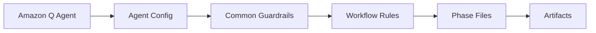

### Workflow Hierarchy

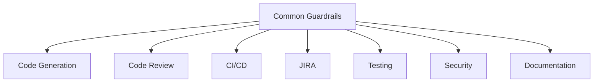

### Workflow to Phases Mapping

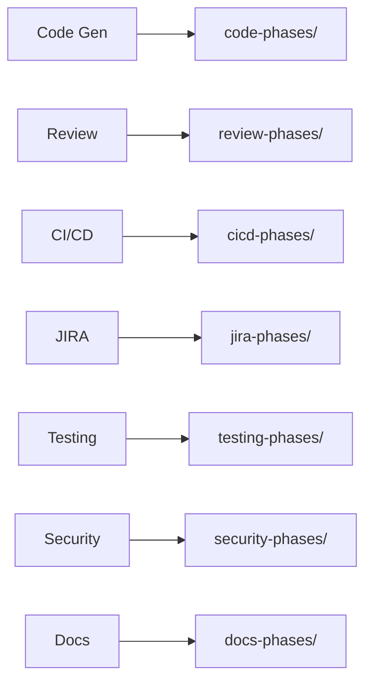

### Phases to Artifacts Mapping

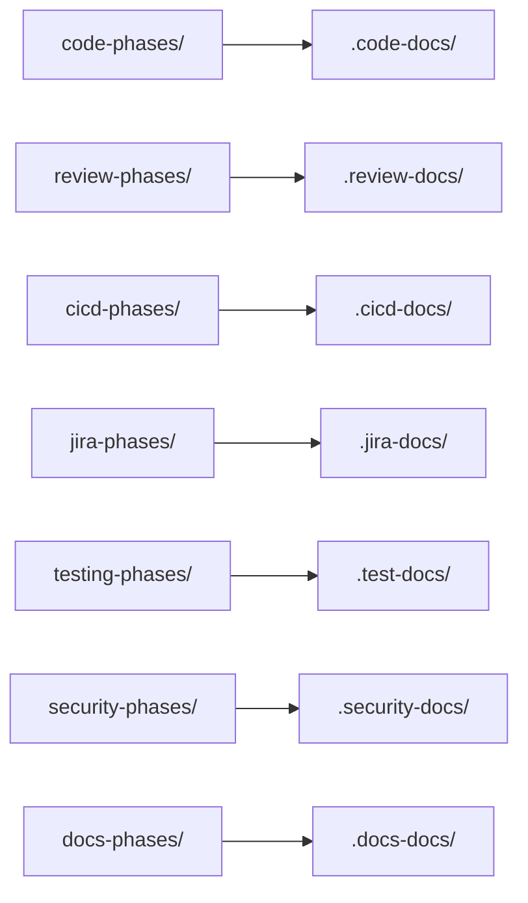

## Core Principles

### 1. **Priority-Based Workflow Selection**

Each workflow has a **PRIORITY** declaration that determines when it should be activated. Workflows override other rules when their trigger conditions are met.

### 2. **Phase-Based Execution**

All workflows follow a consistent phase-based pattern:

- Each phase has a dedicated instruction file (`phaseN-*.md`)
- Phases require explicit user approval before proceeding
- Progress is tracked in state files and audit logs

### 3. **Session Continuity**

- State files track current phase and progress
- Artifacts serve as source of truth if state files are missing
- Context is loaded incrementally per phase

### 4. **Shared Guardrails**

The `common-workflow-guardrails.md` file provides unified rules for:

- Session detection and continuity
- Approval logging (ISO 8601 timestamps)
- Git hygiene reminders
- Progress tracking

## Workflows

### 1. Code Generation Workflow 🚀

**Trigger**: Implementing JIRA tickets, building features, or generating IaC/application code

**Phases**:

1. **Select Requirements** - List tickets, pick scope, choose stack
2. **Generate Code** - Produce IaC + app code + tests
3. **Review & Refine** - Lint, test, document, address feedback
4. **Commit & Push** - With approval, commit/push changes

**Artifacts**: `.code-docs/` directory

### 2. Code Review Workflow 🔍

**Trigger**: Code review, PR review, code analysis, or code inspection requests

**Phases**:

1. **Analyze Changes** - Understand diff scope, load PR context
2. **Review Code** - Deep review using standards + findings capture
3. **Provide Feedback** - Produce findings, recommendations, action items
4. **Finalize Review** - Consolidate reports, approvals, close session

**Artifacts**: `.review-docs/` directory

### 3. CI/CD GitHub Workflow 🚀

**Trigger**: Creating, updating, or regenerating GitHub Actions workflows

**Phases**:

1. **Detect & Plan** - Analyze codebase, inventory code types, create dependency map
2. **Generate Workflow** - Create `.github/workflows/ci-cd.yml`
3. **Review & Confirm** - Validate jobs, checklists, dependencies
4. **Commit & Push** - With approval, commit/push workflow

**Artifacts**: `.cicd-docs/` directory + `.github/workflows/ci-cd.yml`

### 4. JIRA Task Workflow 🎯

**Trigger**: Help with JIRA tickets, requirements intake, or JIRA updates

**Phases**:

1. **Fetch & Select Tickets** - Retrieve tickets from JIRA, user selects
2. **Generate Requirements** - Create technical specification
3. **Final Confirmation & JIRA Update** - Approve requirements, update JIRA status

**Artifacts**: `.jira-docs/` directory

### 5. Testing Workflow 🧪

**Trigger**: Testing, test generation, test execution, coverage goals, or QA automation

**Phases**:

1. **Analyze & Plan** - Inspect codebase, draft strategy, define coverage targets
2. **Generate Tests** - Produce unit/integration/E2E/perf tests
3. **Execute & Validate** - Run suites, capture coverage + results
4. **Review & Integrate** - Summarize quality, integrate into CI/CD

**Artifacts**: `.test-docs/` directory

### 6. Security Workflow 🔒

**Trigger**: Security scans, vulnerability analysis, SAST/DAST, or remediation guidance

**Phases**:

1. **Scan & Analyze** - Run SAST/DAST/dependency/secret/IaC scans
2. **Assess & Prioritize** - Rate severity, map risk to assets
3. **Remediate & Fix** - Apply fixes, improve configs
4. **Verify & Report** - Re-test, finalize reports, integrate with CI/CD

**Artifacts**: `.security-docs/` directory

### 7. Documentation Workflow 📚

**Trigger**: Documentation, README/API docs, architecture notes, or technical writing

**Phases**:

1. **Analyze & Plan** - Audit existing docs, define audiences, build doc plan
2. **Generate Documentation** - Write README/API/architecture/content
3. **Review & Refine** - Edit for clarity, accuracy, completeness
4. **Publish & Integrate** - Final approvals, publishing, repo/CI hooks

**Artifacts**: `.docs-docs/` directory

## Workflow Structure

Each workflow follows this consistent structure:

### Workflow Initiation

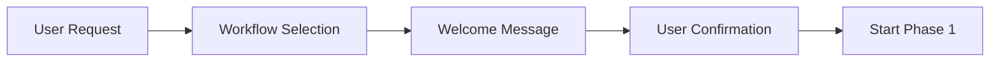

### Phase Execution Loop

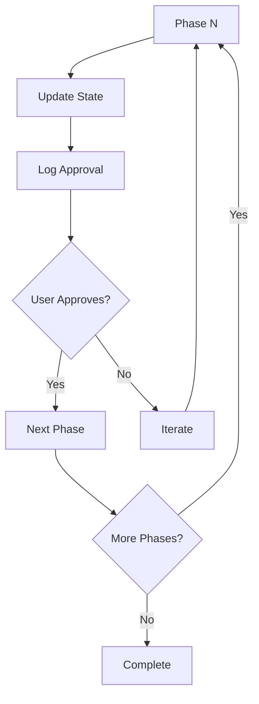

## State Management

Each workflow maintains its own state and artifacts:

### State Components

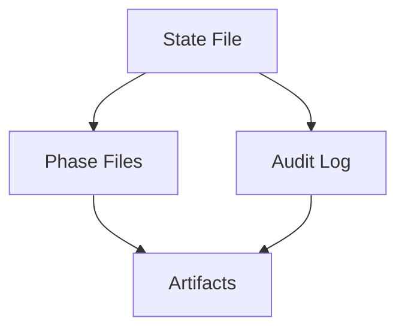

### Session Continuity Flow

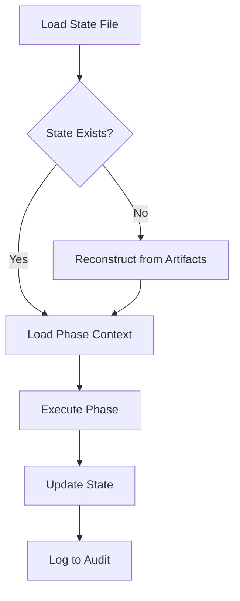

### State File Structure

Each workflow maintains a state file (e.g., `code-state.md`, `review-state.md`) that tracks:

- Current phase
- Phase completion status
- Key decisions and selections
- Context summary

### Audit Logging

All workflows log approvals using ISO 8601 timestamps:

```markdown
## Phase X: <Phase Name>

**Timestamp**: 2025-01-28T14:32:15Z
**Prompt**: "<Exact text asked to the user>"
**Response**: "<User's exact reply>"
**Status**: Approved | Rejected | Pending
**Context**: <Optional notes>
```

## MCP Integration

The workflows integrate with various MCP (Model Context Protocol) servers:

### Available MCP Servers

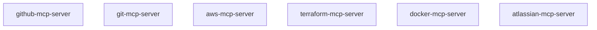

### Code Generation MCP Usage

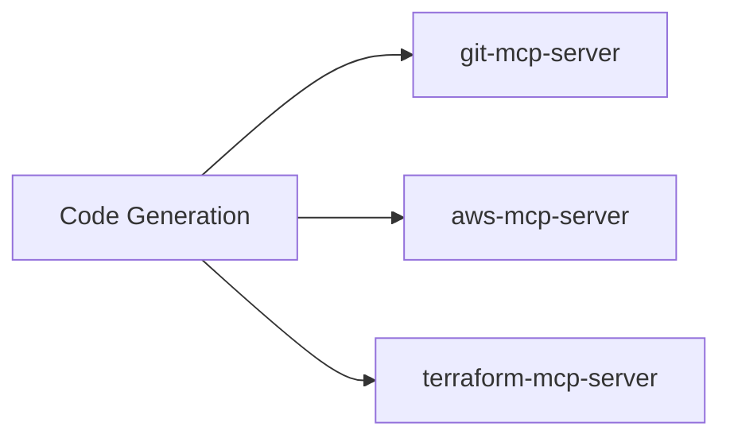

### Code Review MCP Usage

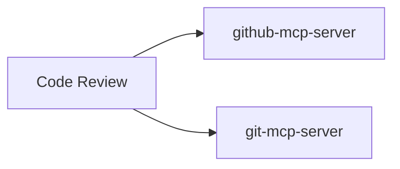

### CI/CD MCP Usage

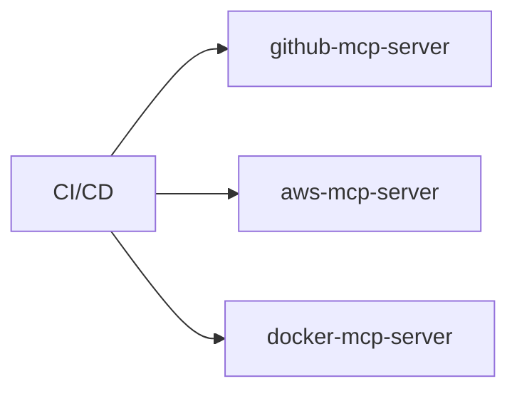

### Security MCP Usage

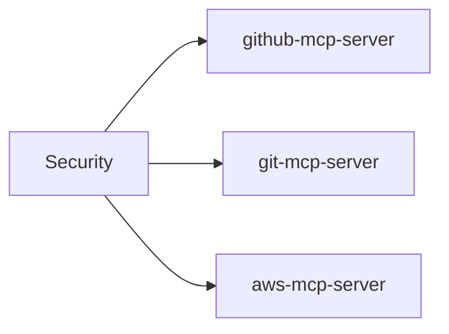

### MCP Usage by Workflow

| Workflow        | MCP Servers Used                                           | Purpose                                                      |
| --------------- | ---------------------------------------------------------- | ------------------------------------------------------------ |
| Code Generation | `aws-mcp-server`, `terraform-mcp-server`, `git-mcp-server` | Inspect AWS resources, validate IaC, manage branches         |
| Code Review     | `github-mcp-server`, `git-mcp-server`                      | Fetch PR metadata, inspect diffs, post findings              |
| CI/CD           | `github-mcp-server`, `aws-mcp-server`, `docker-mcp-server` | Inspect repo settings, verify IAM roles, validate containers |
| JIRA            | `atlassian-mcp-server`                                     | Fetch tickets, update status, create issues                  |
| Security        | `github-mcp-server`, `aws-mcp-server`, `git-mcp-server`    | Check security alerts, inspect IAM, scan history             |
| Testing         | `github-mcp-server`, `git-mcp-server`                      | Post results to PRs, create branches                         |
| Documentation   | `github-mcp-server`, `git-mcp-server`                      | Open doc PRs, branch + commit updates                        |

## Directory Structure

```
.amazonq/
├── agents/
│   └── default.json              # Agent configuration with MCP servers
├── rules/
│   ├── common-workflow-guardrails.md  # Shared rules for all workflows
│   ├── generate-code-workflow.md      # Code generation workflow
│   ├── review-workflow.md             # Code review workflow
│   ├── cicd-github-workflow.md        # CI/CD workflow
│   ├── jira-task-workflow.md          # JIRA task workflow
│   ├── testing-workflow.md            # Testing workflow
│   ├── security-workflow.md           # Security workflow
│   ├── docs-workflow.md               # Documentation workflow
│   ├── code-phases/                   # Code generation phase files
│   ├── review-phases/                 # Code review phase files
│   ├── cicd-phases/                   # CI/CD phase files
│   ├── jira-phases/                   # JIRA phase files
│   ├── testing-phases/                # Testing phase files
│   ├── security-phases/               # Security phase files
│   └── docs-phases/                   # Documentation phase files
└── DONOTDELETE.md                     # Warning file

Project Artifacts (created during workflow execution):
├── .code-docs/                        # Code generation artifacts
├── .review-docs/                      # Code review artifacts
├── .cicd-docs/                        # CI/CD artifacts
├── .jira-docs/                        # JIRA artifacts
├── .test-docs/                        # Testing artifacts
├── .security-docs/                    # Security artifacts
└── .docs-docs/                        # Documentation artifacts
```

## Workflow Relationships

Workflows can interact with each other:

### Primary Workflow Chain

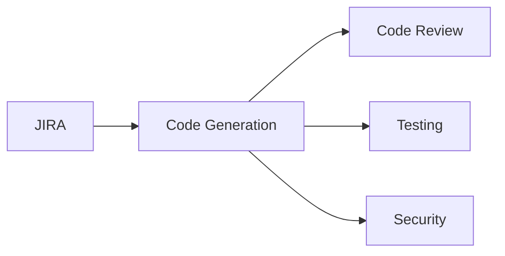

### CI/CD Integration

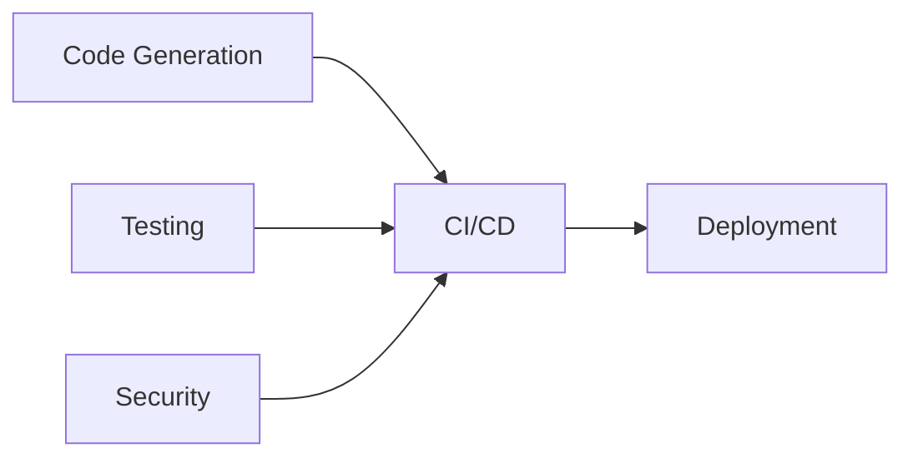

### Documentation Flow

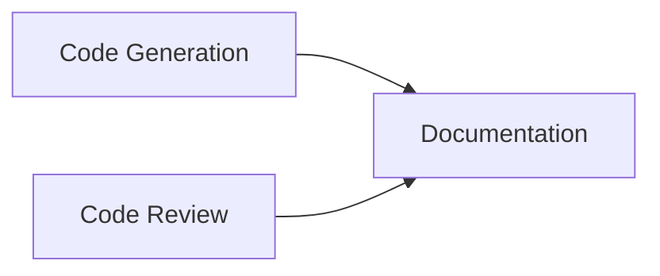

## Usage Guidelines

### 1. **Workflow Selection**

- Amazon Q automatically selects workflows based on user requests
- Each workflow has priority rules that determine activation
- Workflows can override others when their trigger conditions are met

### 2. **Starting a Workflow**

- User makes a request (e.g., "Review this PR", "Generate CI/CD pipeline")
- Amazon Q displays the workflow welcome message
- User must confirm understanding before Phase 1 begins

### 3. **Phase Execution**

- Each phase loads context from previous phases
- State files and artifacts are updated in real-time
- User approval is required before advancing to the next phase

### 4. **Session Continuity**

- If a session is interrupted, Amazon Q reconstructs state from artifacts
- State files are "best effort" - artifacts are the source of truth
- Context is loaded incrementally per phase

### 5. **Artifact Management**

- Each workflow creates artifacts in its designated directory
- Artifacts follow naming conventions (kebab-case)
- Users are reminded to commit artifacts after each phase

### 6. **Language/Stack Standards**

- Workflows check for language-specific standards files
- If missing, standards files are created following existing patterns
- Standards ensure consistency across code generation and review

## Best Practices

1. **Always commit artifacts** after each phase completes
2. **Review state files** to understand current progress
3. **Check audit logs** for approval history
4. **Use MCP servers** to fetch real-time context before making decisions
5. **Follow naming conventions** for all generated artifacts
6. **Update checkboxes** in plan files immediately after completing work

## Configuration

The agent configuration (`.amazonq/agents/default.json`) defines:

- Available MCP servers (Atlassian, AWS, GitHub, etc.)
- Tool permissions and presets
- Resource paths for rules
- Tool aliases and settings

## Important Notes

⚠️ **Warning**: Do not update, modify, or delete any files in `.amazonq/` directory. This is enforced by `DONOTDELETE.md`.

## Summary

The Amazon Q Rules system provides a structured, phase-based approach to AI-assisted software development. By following consistent patterns across workflows, maintaining state and audit logs, and integrating with MCP servers, the system ensures reliable, traceable, and repeatable development processes.

Each workflow is designed to be:

- **Predictable**: Clear phases with defined entry/exit points
- **Traceable**: Comprehensive audit logging and state management
- **Flexible**: Can be interrupted and resumed seamlessly
- **Integrated**: Works with external tools via MCP servers
- **Consistent**: Shared guardrails ensure uniform behavior
